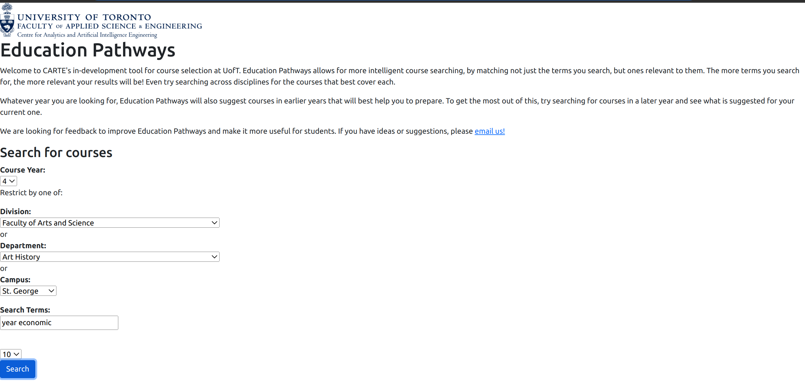

Contributors: Matt Agar, Ron Thomas, Richard Zhang

This repo is a clone of: https://github.com/nelaturuk/education_pathways

## Activity 1 

## Activities 2-3 

## Activities 2-5
Home page:

Search results:

Note: Screenshots have been zoomed out to fit everything

## Activity 6
User story 1.1: Adding filters on search page:

Before filter selected:

After filter selected:

User story 2.1: Course Information

User story 4.1: Frontend design for admin course edit page

